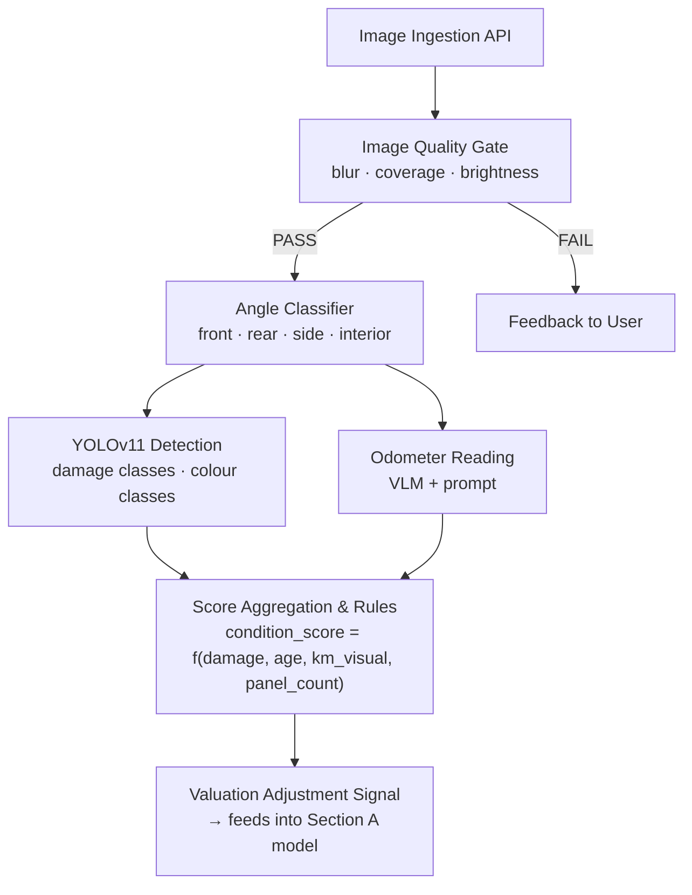

# Datium Data Science Assessment – Section B
## Visual Analysis of Vehicle Images

This document is a **design and strategy report** — not a training run (no labelled image dataset is provided).
The goal is to demonstrate how a practical end-to-end image-intelligence system would be designed for an automotive assessment business.

---

## 1. Problem Framing

### Business Context
Datium receives **user-submitted vehicle images** as part of commercial assessments (e.g. trade-in, insurance, fleet valuation).
The images are uncontrolled: variable lighting, angles, backgrounds, and image quality.

### Possible Actionable Outputs

| Signal | Value to Business |
|--------|------------------|
| **Damage detection** | Identify dents, scratches, cracks → adjust valuation downward |
| **Vehicle condition score** | Aggregate visual health score (0–10) |
| **Colour identification** | Automate a common data entry field |
| **Body style classification** | Sedan vs SUV vs Ute → supports market segmentation |
| **Odometer/dash reading** | VLM prompt on interior photo → extract numeric reading → cross-validate KM field |
| **Image quality gating** | Reject blurry/incomplete images before downstream processing |

### Chosen Focus: Damage Detection + Condition Scoring
This is the highest-value signal: damage directly affects resale price, it is labour-intensive to assess manually, and modern vision models are well-suited to it.

---

## 2. Data Assumptions & Challenges

### What we assume about incoming images
- JPEG/PNG, typical smartphone quality (2–12 MP)
- 1–10 photos per vehicle (exterior: front, rear, sides; interior; odometer)
- Submitted by non-expert users — inconsistent framing, glare, obstructions

### Key data challenges

| Challenge | Mitigation |
|-----------|------------|
| **No labelled damage dataset** | Combine public datasets (CARDD, VCoR) with in-house labelling (CVAT) |
| **Class imbalance** (most cars undamaged) | Focal loss, oversampling damaged examples, threshold tuning |
| **Variable image angle** | Multi-view aggregation; angle classification as pre-step |
| **Low-quality images** | Image quality classifier as first gate; feedback to user |
| **Privacy (licence plates, faces)** | Auto-blur in pre-processing pipeline |
| **Adversarial submissions** (hiding damage) | Anomaly detection; consistency checks against odometer KM |

---

## 3. Modelling Approaches

### 3.1 Approach A – Fine-tuned CNN Classifier (Baseline)

```
Input image → EfficientNet-B3 backbone (ImageNet pretrained)
           → Global average pooling
           → Dense head → Condition score (regression) + Damage present (binary)
```

- **Pros:** Fast inference, well-understood, easy to deploy
- **Cons:** No spatial localisation — can't say *where* the damage is

---

### 3.2 Approach B – Object Detection for Damage Localisation

```
Input image → YOLOv11 / RT-DETRv2
           → Bounding boxes: {scratch, dent, crack, rust, broken_glass}
           → Classification heads: {colour class per panel}
           → Damage area fraction + dominant colour → condition score formula
```

- **Pros:** Single-model inference for both damage and colour; interpretable bounding boxes; actionable per-damage-type pricing
- **Cons:** Requires polygon/bbox annotations for damage and colour-labelled panels (expensive)

---

### 3.3 Approach C – Vision–Language Foundation Model (Zero/Few-Shot)

```
Input image + prompt → GPT-5.2 / Gemini 3.1 Pro
                     → Structured JSON: {has_damage, severity, affected_panels, notes}
```

**Damage detection prompt:**
```
"Inspect this vehicle image. Return JSON:
  has_damage (bool), severity (none/minor/moderate/severe),
  affected_panels (list), confidence (0–1).
  Focus only on visible damage to paintwork, glass, and body panels."
```

**Odometer reading prompt (interior photo):**
```
"This is a photo of a vehicle dashboard or odometer display.
  Extract the odometer reading and return JSON:
  odometer_km (integer or null if not visible),
  unit (km/miles), confidence (0–1),
  notes (any relevant context, e.g. partial occlusion)."
```

- **Pros:** No training data needed to start; handles edge cases well; human-readable explanations
- **Cons:** API cost at scale; latency; not suitable for offline/edge deployment

---

### 3.4 Recommended Hybrid Architecture



---

## 4. Condition Score — Mathematical Definition

The condition score $S$ is a continuous value on **[0, 10]**, where 10 represents a pristine vehicle and 0 represents severe/total damage.

### 4.1 Component Definitions

**Damage penalty** $P_d$ — derived from YOLOv11 detections:

$$P_d = \sum_{i=1}^{N} w_i \cdot a_i$$

where:
- $N$ = number of detected damage instances
- $a_i$ = area fraction of detection $i$ relative to total image area $\in [0, 1]$
- $w_i$ = severity weight for damage class $i$:

| Class | $w_i$ |
|-------|--------|
| scratch | 1.0 |
| dent | 2.0 |
| crack | 2.5 |
| rust | 3.0 |
| broken\_glass | 4.0 |

**Age penalty** $P_a$:

$$P_a = \alpha \cdot \text{age\_years}, \quad \alpha = 0.15$$

**KM penalty** $P_k$:

$$P_k = \beta \cdot \mathbb{1}[\text{km\_visual} > 150{,}000], \quad \beta = 0.5$$

**Panel penalty** $P_p$:

$$P_p = \gamma \cdot \text{panel\_count}, \quad \gamma = 0.3$$

### 4.2 Final Score

$$S = \max\!\left(0,\ 10 - P_d - P_a - P_k - P_p\right)$$

### 4.3 Bucketing for Business Rules

The continuous score $S$ is mapped to an ordinal condition grade:

| Grade | Score range | Description |
|-------|-------------|-------------|
| **Excellent** | $S \geq 8.5$ | Near-new, no visible damage |
| **Good** | $7.0 \leq S < 8.5$ | Minor cosmetic wear only |
| **Fair** | $5.0 \leq S < 7.0$ | Moderate damage, high KM |
| **Poor** | $S < 5.0$ | Significant damage, requires repair |

The grade feeds directly into Section A's valuation adjustment as an ordinal encoded feature.

---

## 5. Evaluation Strategy

### Damage Detection (object detection)
- **mAP@0.5** per damage class
- **Precision / Recall** at business-relevant operating points
  (prefer high recall for severe damage — false negatives cost more than false positives)

### Condition Score (regression)
- **MAE / RMSE** vs human assessor ground truth
- **Pearson / Spearman correlation** with final adjusted sale price
- **Inter-rater agreement** (Cohen's κ on ordinal score buckets)

### End-to-End Business Metric
- **Δ valuation accuracy**: Does adding the image score reduce MAE in Section A's price model?
  Measure: `MAE_with_image_feature` vs `MAE_without`

---

## 6. Practical Constraints & Trade-offs

| Constraint | Consideration |
|------------|---------------|
| **Data labelling cost** | Start with foundation model (Approach C) to bootstrap damage + colour labels cheaply; then fine-tune YOLOv11 on both tasks |
| **Inference latency** | YOLOv11-nano gives <50 ms on CPU; adequate for near-real-time assessment |
| **Model updates** | Damage styles evolve (EV battery enclosures, new materials); plan quarterly re-training |
| **Explainability** | Bounding boxes + severity labels are explainable to assessors and customers |
| **Reliability** | Always provide a human override path; model is advisory, not authoritative |
| **Scale** | At 10k assessments/day with 5 images each → 50k images/day; batch GPU inference is cost-effective |

---

## 7. MVP Implementation Roadmap

### Phase 1 – Foundation (2–4 weeks)
- Image quality gate using OpenCV (Laplacian variance for blur, coverage heuristics)
- Zero-shot damage classification with a vision LLM → generate weak labels
- Evaluate LLM output quality against 200 human-labelled images

### Phase 2 – Supervised Model (4–8 weeks)
- Label 2,000–5,000 images (bounding boxes for damage + colour class per panel) using CVAT
- Fine-tune YOLOv11-m on unified damage + colour detection
- A/B test: does image-derived condition score improve Section A model's MAE?

### Phase 3 – Production Integration (ongoing)
- Wrap in FastAPI microservice; integrate with vehicle assessment workflow
- Active learning loop: flag uncertain predictions for human review → grow labelled set
- Drift monitoring: track prediction distribution shifts over time
